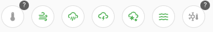
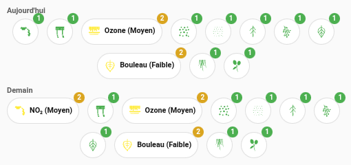

# lovelace-env-alert-chips

[![HACS][hacs-badge]][hacs-url]
[![GitHub Release][release-badge]][release-url]
[![Build][build-badge]][build-url]
[![HACS Validation][validate-badge]][validate-url]

Two Lovelace cards for French environmental alert services, rendered as [Mushroom](https://github.com/piitaya/lovelace-mushroom) chips.

| Card | Service | Data |
|------|---------|------|
| `weather-alert-chips-card` | [Météo-France](https://vigilance.meteofrance.fr/) | Vigilance weather alerts (wind, storms, flood, snow, …) |
| `atmo-alert-chips-card` | [AtmoFrance](https://www.atmo-france.org/) | Air quality index + pollen levels |

---

## Installation

### HACS (recommended)

1. Open **HACS → Frontend**.
2. Click **⋮ → Custom repositories** and add `https://github.com/yoda-jm/lovelace-env-alert-chips` with category **Dashboard**.
3. Search for **Weather Alert Chips Card** and install it.
4. Add the resource or reload your browser.

### Manual

1. Download `lovelace-env-alert-chips.js` from the [latest release][release-url].
2. Copy it to `config/www/`.
3. Add it as a Lovelace resource: **Settings → Dashboards → Resources → Add resource**
   - URL: `/local/lovelace-env-alert-chips.js`
   - Type: **JavaScript module**

---

## `weather-alert-chips-card`



Displays Météo-France vigilance alerts as coloured chips. Requires the [Météo-France](https://www.home-assistant.io/integrations/meteo_france/) integration.

### Options

| Key | Type | Required | Default | Description |
|-----|------|----------|---------|-------------|
| `type` | string | ✓ | — | `custom:weather-alert-chips-card` |
| `entity` | string | ✓ | — | The vigilance sensor, e.g. `sensor.68_weather_alert` |
| `alignment` | string | | `center` | Chip alignment: `center`, `start`, `end` |
| `allowlist` | list | | — | Show only these alert types (always visible even when green) |
| `blocklist` | list | | — | Never show these alert types |
| `alert_types` | list | | — | Full override of alert definitions (see below) |

### Alert colours

| Level | Colour |
|-------|--------|
| `vert` (green) | Hidden by default |
| `jaune` (yellow) | Yellow |
| `orange` | Orange |
| `rouge` (red) | Red |

### Example

```yaml
type: custom:weather-alert-chips-card
entity: sensor.68_weather_alert
alignment: center
blocklist:
  - Grand-froid
```

### Custom alert types

```yaml
type: custom:weather-alert-chips-card
entity: sensor.68_weather_alert
alert_types:
  - type: Canicule
    icon: mdi:thermometer-high
  - type: Orages
    icon: mdi:weather-lightning
```

---

## `atmo-alert-chips-card`



Displays AtmoFrance air quality and pollen levels as chips. Requires the [AtmoFrance](https://github.com/sebcaps/atmofrance) integration.

Each chip uses a custom icon (pollen type or pollutant) with optional badges:
- **Top-right badge**: numeric level (e.g. `3`)
- **Bottom-right badge**: concentration in µg/m³ (pollen detail only)

Detail chips show the type name and level label: e.g. **Bouleau (Faible)**, **Ozone (Moyen)**.

### Options

| Key | Type | Required | Default | Description |
|-----|------|----------|---------|-------------|
| `type` | string | ✓ | — | `custom:atmo-alert-chips-card` |
| `device_id` | string | ✓* | — | AtmoFrance device ID. Today/tomorrow entities are resolved automatically. |
| `date` | string | | `today` | Which day to show: `today`, `tomorrow`, or `both` (two rows) |
| `mode` | string | | `both` | Which data to show: `air_quality`, `pollen`, or `both` |
| `detail_level` | string | | `global` | `global` (summary chip only), `detail` (per-type chips), or `both` |
| `alignment` | string | | `center` | Chip alignment: `center`, `start`, `end` |
| `split_rows` | boolean | | `false` | Show air quality and pollen on separate rows |
| `show_day_label` | boolean | | `false` | Show "Aujourd'hui" / "Demain" section labels |
| `show_level_badge` | boolean | | `false` | Show numeric level badge (top-right corner) |
| `show_concentration` | boolean | | `false` | Show concentration badge µg/m³ (bottom-right, pollen detail only) |
| `hide_unavailable` | boolean | | `true` | Hide chips whose entity is unavailable or unknown |
| `hide_good` | boolean | | `true` | Hide chips at the best level (Bon / Nul) |

*`device_id` is required unless `entity_aq_today` or `entity_today` is provided (legacy override).

### Pollen levels

| Value | Meaning | Colour |
|-------|---------|--------|
| 0 | Nul | Hidden (when `hide_good: true`) |
| 1 | Très faible | Green (icon only) |
| 2 | Faible | Yellow |
| 3 | Moyen | Orange |
| 4 | Élevé | Red |
| 5 | Très élevé | Purple |

### Air quality levels

| Value | Meaning | Colour |
|-------|---------|--------|
| 1 | Bon | Green (hidden when `hide_good: true`) |
| 2 | Moyen | Yellow |
| 3 | Dégradé | Orange |
| 4 | Mauvais | Red |
| 5 | Très mauvais | Purple |
| 6 | Extrêmement mauvais | Dark red |

### Examples

Minimal — global summary only, today:

```yaml
type: custom:atmo-alert-chips-card
device_id: a1b2c3d4e5f6...
```

Full detail with split rows:

```yaml
type: custom:atmo-alert-chips-card
device_id: a1b2c3d4e5f6...
date: both
detail_level: both
split_rows: true
show_day_label: true
show_level_badge: true
show_concentration: true
```

Air quality only, detail view:

```yaml
type: custom:atmo-alert-chips-card
device_id: a1b2c3d4e5f6...
mode: air_quality
detail_level: detail
```

---

## Requirements

- Home Assistant 2023.9+
- [Mushroom](https://github.com/piitaya/lovelace-mushroom) cards installed

---

## Acknowledgements

Pollen and air quality particulate icons used in `atmo-alert-chips-card` are derived from
[pollenprognos-card](https://github.com/krissen/pollenprognos-card) by
[@krissen](https://github.com/krissen), licensed under the
[Apache License 2.0](https://github.com/krissen/pollenprognos-card/blob/master/LICENSE).

---

## License

This project is licensed under the [Apache License 2.0](LICENSE).

[hacs-badge]: https://img.shields.io/badge/HACS-Custom-orange.svg
[hacs-url]: https://my.home-assistant.io/redirect/hacs_repository/?owner=yoda-jm&repository=lovelace-env-alert-chips&category=lovelace
[release-badge]: https://img.shields.io/github/v/release/yoda-jm/lovelace-env-alert-chips
[release-url]: https://github.com/yoda-jm/lovelace-env-alert-chips/releases/latest
[build-badge]: https://img.shields.io/github/actions/workflow/status/yoda-jm/lovelace-env-alert-chips/build.yml?label=build
[build-url]: https://github.com/yoda-jm/lovelace-env-alert-chips/actions/workflows/build.yml
[validate-badge]: https://img.shields.io/github/actions/workflow/status/yoda-jm/lovelace-env-alert-chips/validate.yml?label=HACS
[validate-url]: https://github.com/yoda-jm/lovelace-env-alert-chips/actions/workflows/validate.yml
